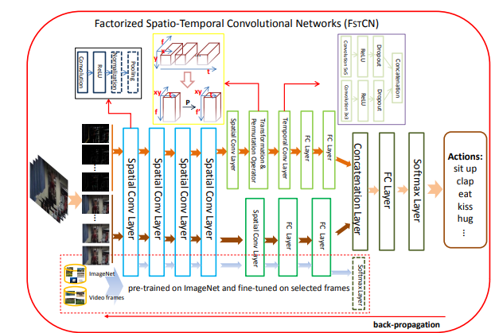
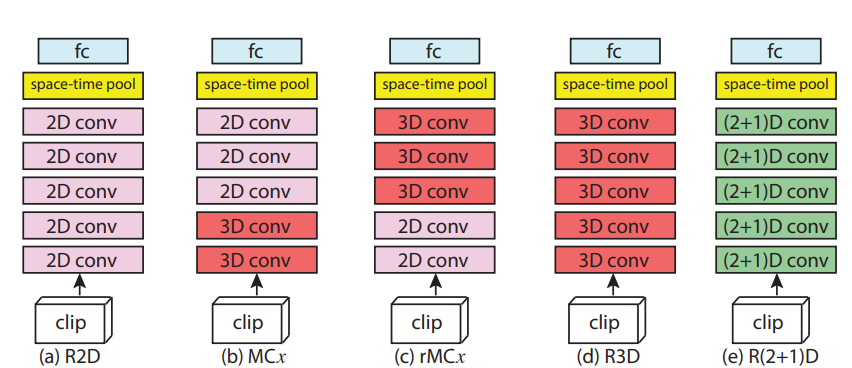
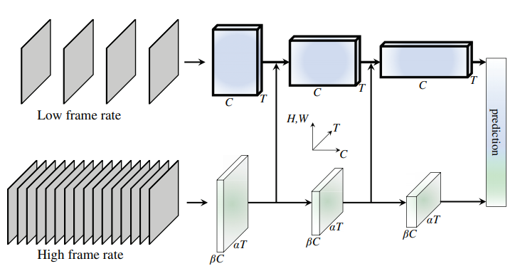

# Activity Recognition 🏊🏼‍♀️💃🏼

1. [Literature Implementations 📔](#literature-implementations-)
2. [Datasets (TBD)💾](#datasets-)
3. [FineTune models](#finetune-models-)
4. [Reports and model weights 📈 (TBD)](#reports-and-model-weights-)
5. [Project structure 🏗️](#project-structure-%EF%B8%8F)
6. [Roadmap 🗺️](#roadmap)
7. [Useful Applications 📔](#applications)
8. [References 🧾](#references)

## Literature Implementations 📔

### LRCN

Model described at [Long-term Recurrent Convolutional Networks for Visual 
Recognition and Description](https://arxiv.org/pdf/1411.4389.pdf).


You can easily train it on UCF-101 using the following command:

```bash
$ python -m ar train-lrcn \
    --dataset UCF-101 \
    --data-dir data/ucf-101/videos/ --annots-dir data/ucf-101/annots/  \
    --frames-per-clip 16 --batch-size 4 --learning-rate 3e-4 \
     --save-checkpoint models/lrcn-ucf-101.pt
```

### FstCN

Model described at [Human Action Recognition using Factorized Spatio-Temporal 
Convolution Networks](https://arxiv.org/pdf/1510.00562.pdf).



You can easily train it on UCF-101 using the following command:

```bash
$ python -m ar train-fstcn \
    --dataset UCF-101 \
    --data-dir data/ucf-101/videos/ --annots-dir data/ucf-101/annots/  \
    --frames-per-clip 16 --batch-size 4 --learning-rate 3e-4 \
     --save-checkpoint models/lrcn-ucf-101.pt
```

### R(2+1)D

Model described at [A Closer Look at Spatiotemporal Convolutions for 
Action Recognition](https://arxiv.org/pdf/1711.11248.pdf).

We've implemented the more promising architecture, the one composed only with
factorized spatio temporal convolutions (depicted at the right of the below image):



You can easily train it on UCF-101 using the following command:

```bash
$ python -m ar train-r2plus1d \
    --dataset UCF-101 \
    --data-dir data/ucf-101/videos/ --annots-dir data/ucf-101/annots/  \
    --frames-per-clip 16 --batch-size 4 --learning-rate 3e-4 \
     --save-checkpoint models/lrcn-ucf-101.pt
```

### SlowFast network

Model described at [SlowFast Networks for Video Recognition
](https://arxiv.org/abs/1812.03982).

We've implemented it using 3D ResNet-18 as the pathways.



You can easily train it on UCF-101 using the following command:

```bash
$ python -m ar train-slowfast \
    --dataset UCF-101 \
    --data-dir data/ucf-101/videos/ --annots-dir data/ucf-101/annots/  \
    --frames-per-clip 16 --batch-size 4 --learning-rate 3e-4 \
     --save-checkpoint models/lrcn-ucf-101.pt
```

## Datasets 💾

TBD

## FineTune models 🎨

If you want to train a model with a standard configuration and a dataset structure
already defined (see Datasets) we recommend using the CLI instead of the following
coding approach. See Literature Implementations to learn how to use the CLI.

If you want more information about the CLI you can run the help command:

```bash
$ python -m ar train-lrcn --help
$ python -m ar train-fstcn --help
$ python -m ar train-slowfast --help
$ python -m ar train-r2plus1d --help
```
All the models implemented inside the `ar.video` module, are ready to use. Therefore, you can train or even finetune them using your own dataset.

1. Instantiate the model you prefer. Since all models share the same head (Linear layer with a log softmax activation), can easily be changed without further effort.

```python
import ar
import torch

model = ar.video.LRCN(...)
model = ar.video.FstCN(...)
model = ar.video.SlowFast(...)
```

2. Create the dataset. You can use an existing dataset, or create a custom one.
In the case you decide to create a custom dataset, make sure it returns a tuple of video clip of
shape (FRAMES, HEIGHT, WIDTH, CHANNELS) and the label as an integer.

```python
import ar.transforms as VT
import torchvision.transforms as T

tfms = T.Compose([VT.VideoToTensor(),
                  VT.VideoResize((112, 112)),
                  VT.VideoNormalize(**VT.imagenet_stats)])

ds = ar.data.UCF101('dataset-path/clips', 
                    annotation_path='dataset-path/annots', 
                    split='ar', frames_per_clip=16,
                    transforms=tfms)
```

3. Create the data loader to batch the data. You can use whatever sampler you 
belive appropiate, but for we recommend the `RandomClipSampler` and the `UniformClipSampler`,
for training and evaluation respectively. 

```python
from torchvision.datasets.samplers import RandomClipSampler

sampler = RandomClipSampler(ds.video_clips, 10)
dl = torch.utils.data.DataLoader(ds, batch_size=32, sampler=sampler)
```

4. Train the model!

```python
# Please create a better optimizers an complement it with an Scheduler 😁
trainable_ps = [p for p in model.parameters() if p.requires_grad]
optimizer = torch.optim.SGD(trainable_ps, lr=1e-4)

# For tensorboard logging
logger = ar.logger.build_summary_writter('logs')

ar.video.train(model=model, optimizer=optimizer,
               train_dl=dl, valid_dl=...,
               epochs=10,
               save_checkpoint='model.pt',
               summary_writer=logger)

# The checkpoint is a torch pickle containing
# {'config': Model configuration to reinitialize the model with the same hyper params,
#  'optimizer': optimizer.state_dict(),
#  'scheduler': scheduler.state_dict(),
#  'model': model.state_dict()
# }
```

## Applications

### Obtaining candidate clips

Reproduce **Obtaining candidate clips** section from Kinetics400 paper [1].

Nowadays, accessing a set of YouTube videos is trivial, therefore to start
we can download a few videos from this source.

As stated in [1], image classifiers are simple to train using a google image
dataset with few efforts. We can take advantage of this, and approximately
detect at which time an *interesting* action occurs in the video by just 
performing inference over that video at frame level. 

To do so, we first need to create an image dataset containing images of people
doing certain actions. To get things simpler, I developed a selenium scraper 
to automatically search on google images for the desired actions and 
download the resulting images.

To generate the dataset run: 

```bash
$ python -m ar.data.build_image_ds \
    --actions data/kinetics400.names \
    --out-path data/kinetics400-image \
    --images-per-action 9999 \
    --num-workers 8
```

Once we have the dataset downloaded, we can train an image classifier using this
data by running:

```bash
$ python -m ar.models.image.train \
    --data-dir data/kinetics400-image \
    --epochs 8 \
    --batch-size 32 \
    --learning-rate 3e-5 \
    --feature-extractor densenet121 \
    --save-checkpoint model.pt
```

You can modify the hyperparameters as you wish.

Finally, we run this classifier at the frame level over a video with the 
command:

```bash
$ python -m ar.applications.generate_action_clip \
    --video-path video.mp4 \
    --image-classifier-checkpoint model.pt \
    --class-names data/kinetics400.names \
    --out-dir out/videos
```

## Reports and model weights 📈

TBD

## Project structure 🏗️

The project is thought to be a single python package called `ar`.

```
├── LICENSE
├── README.md          <- README with basic information
├── data/              <- Directory containing bash scripts to download the data 
|                         as well as some class to index files. 
|                         My recommendation is to store the raw data here too.
│
├── notebooks          <- Jupyter notebooks. Just for exploration and examples. 
|                         By default the notebooks are not reproducible.
│
├── requirements.txt   <- `pip freeze > requirements.txt`
│
├── ar                 <- Main python package. `import ar`
│   │
│   ├── data           <- Mainly for `torch.utils.data.Dataset` and other data
|   |                     utilities.
│   │
│   ├── models         <- Models definition and training scripts.
│   │   │                 
│   │   ├── video      <- Video models and video training scripts
│   │   └── image      <- Image models and image training scripts
│   │
│   ├── utils          <- Python and PyTorch utilities to avoid boilerplate code
│   |
|   ├── transforms <- Data transformations compatible with `torchvision`
│   |                 transformations API. `import ar.transforms.functional as F`
|   |                 and `import ar.transforms as T`.
|   |
|   ├── metrics <- Useful metrics for classification such as ``top_k_accuracy``
|   |
|   └── typing.py  <- Convenient type aliases.
|
└── mypy.ini       <- MyPy configuration
```


# Roadmap 🗺️

[ ] Transformations running on GPU with kornia integration.
[ ] Serialize models and store them in a public storage service so everyone can use them.
[ ] Provide a trainer api to make the trainings simpler.
[ ] Dataset registry to allow users create custom datasets and also use the out of the box utilities.

## References

- [1] The Kinetics Human Action Video Dataset - https://arxiv.org/abs/1705.06950
- [2] Long-term Recurrent Convolutional Networks for Visual Recognition and Description - https://arxiv.org/abs/1411.4389
- [3] Human Action Recognition using Factorized Spatio-Temporal Convolutional Networks - https://arxiv.org/abs/1510.00562
- [4] A Closer Look at Spatiotemporal Convolutions for Action Recognition - https://arxiv.org/abs/1711.11248
- [5] SlowFast Networks for Video Recognition - https://arxiv.org/abs/1812.03982

