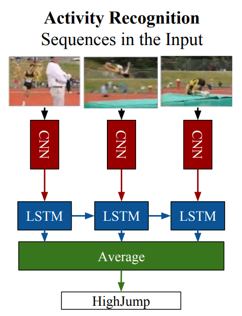

# Activity Recognition 🏊🏼‍♀️💃🏼

## Obtaining candidate clips

Reproduce **Obtaining candidate clips** section from Kinetics400 paper [1].

Nowadays, accessing a set of YouTube videos is trivial, therefore to start
we can download a few videos from this source.

As stated in [1], image classifiers are simple to train using a google image
dataset with few efforts. We can take advantage of this, and approximately
detect at which time an *interesting* action occurs in the video by just 
performing inference over that video at frame level. 

To do so, we first need to create an image dataset containing images of people
doing certain actions. To get things simpler, I developed a selenium scraper 
to automatically search on google images for the desired actions and 
download the resulting images.

To generate the dataset run: 

```bash
$ python -m ar.data.build_image_ds \
    --actions data/kinetics400.names \
    --out-path data/kinetics400-image \
    --images-per-action 9999 \
    --num-workers 8
```

Once we have the dataset downloaded, we can train an image classifier using this
data by running:

```bash
$ python -m ar.models.image.train \
    --data-dir data/kinetics400-image \
    --epochs 8 \
    --batch-size 32 \
    --learning-rate 3e-5 \
    --feature-extractor densenet121 \
    --save-checkpoint model.pt
```

You can modify the hyperparameters as you wish.

Finally, we run this classifier at the frame level over a video with the 
command:

```bash
$ python -m ar.applications.generate_action_clip \
    --video-path video.mp4 \
    --image-classifier-checkpoint model.pt \
    --class-names data/kinetics400.names \
    --out-dir out/videos
```

## Literature Implementations 📔

### LRCN

Model described at [Long-term Recurrent Convolutional Networks for Visual 
Recognition and Description](https://arxiv.org/pdf/1411.4389.pdf).



You can easily train it on UCF-101 using the following command:

```bash
$ python -m ar.models.video.train \
    --dataset UCF-101 \
    --data-dir data/ucf-101/videos/ --annots-dir data/ucf-101/annots/  \
    --frames-per-clip 16 --batch-size 4 --learning-rate 3e-4 \
     --save-checkpoint models/lrcn-ucf-101.pt \
     LRCN <model-args>
```

#### DIY

```python
import ar
import torch

loss_fn = torch.nn.NLLLoss()
model = ar.video.LRCN(...)

# (BATCH, CHANNELS, FRAMES, HEIGHT, WIDTH)
video_batch = torch.randn(4, 3, 16, 224, 224)
out = model(video_batch)
loss = loss_fn(out, gt)
loss.backward()
...
```

## Reports and model weights

TBD

## References

- [1] The Kinetics Human Action Video Dataset - https://arxiv.org/abs/1705.06950
